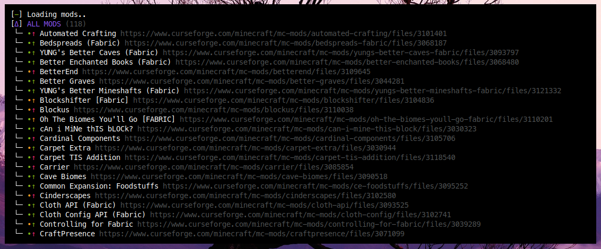

# 📦 PAX - The minecraft modpack manager for professionals

PAX is the solution to modern modpack development for Minecraft, usable both alone and in a team. It supports Forge & Fabric, can be version controlled with git, and one command is all you need in order to upload your pack to Curseforge.

*The following features are implemented*:

- ⌨️ **CLI interface** for quick actions
- 🔎 **Search & Install** for Curseforge mods
- 📥 **Updating one mod or the whole modpack**, automatically selecting the best available version
- 👁️ **Mod Information** (compability & whether an update is available) at one glance (see above picture ;) )
- 💾 **Easily diffable files** for ease of working with git

*The following features are on the roadmap for the following weeks*:

- 🤖 **Continous Integration**
  - You push your project to Github/Gitlab and a runner automatically builds your modpack and uploads it to Curseforge. It's magic, woohoo!
- 🔃 **Minecraft Development Environment**
  - Sync file changes between your project and your minecraft launcher, so you don't have to import your modpack every time you make a change.

## Usage

*The newest version of PAX is available [here](https://github.com/froehlichA/pax/releases/latest).*

Information about how to use PAX is available on the [wiki](https://github.com/froehlichA/pax/wiki), which contains:

- **A [Quickstart](https://github.com/froehlichA/pax/wiki/Quickstart) guide** if you want to get up and running quickly
- **A [Getting Started](https://github.com/froehlichA/pax/wiki/Getting-started) page** for users that want to go more in-depth.

## Why PAX?

| Feature | PAX | Curseforge Launcher | GDLauncher | MultiMC |
| ------- | --- | ------------------- | ---------- | ------- |
| Creating a modpack | 👍 | 👍 | 👍 | 👍 |
| Fabric | 👍 | 👍 | 👍 | 👍 |
| Adding/Removing mods | 👍 | 👍 | 👍 | 👍 |
| Viewing installed mods | 👍 | 👍 | 👍 | 👍 |
| Updating installed mods | 👍 | 👍 | 👍 | ❌ |
| Loader compability information | 👍 | ❌ | 👍 | ❌ |
| Mod compability information | 👍 | ❌ | ❌ | ❌ |
| Mod update availability information | 👍 | 👍 | 👍 | ❌ |
| Export to `.zip` | 👍 | 👍 | 👍 | 👍 |
| Export to Curseforge-compatible `.zip` | 👍 | 👍 | 👍 | ❌ |
| Open Source | 👍 | ❌ | 👍 | 👍 |
| Multiple people working on one modpack | 👍 | ☹️ | ☹️ | ☹️ |
| Concurrent mod updates | 👍 | ❌ | ❌ | ❌ | 
| Version control support | 👍 | ❌ | ❌ | ❌ |
| CI/CD support | W.I.P | ❌ | ❌ | ❌ |
| Project/Minecraft Instance Sync | W.I.P | ❌ | ❌ | ❌ |

---

## PAX Development

You'll need:
* [Nim](https://nim-lang.org/)
* A C compiler (depending on your operating system, one might be already installed)

Clone the repository - and you're good to go!
To build the application, run `nimble build` & execute it with `./pax` (on Linux) or `./pax.exe` (on Windows).

---

## License

PAX is licensed under the [MIT License](license.md).
